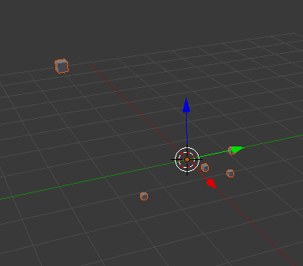

.. _getting_started:

Getting Started
===============

To introduce you to Blendplot, we will show how to take a simple dataset, plot it using Blendplot, and then load the created model into Blender. The dataset we will be using is a dummy dataset for products sold in a supermarket.

Getting the data
----------------

This dataset contains information on items and includes their product name, cost, weight, height, quantity, and type. The dataset is defined below.

::

    "product","cost","weight","height","quantity","type"
    "milk",8.99,10.0,2.0,25,"food"
    "chocolate",5.99,15.2,0.5,10,"food"
    "bannana",2.99,2.0,0.5,20,"food"
    "television",199.99,100.0,10.2,3,"electronic"
    "laptop"149.99,5.0,1.0,5,"electronic"

Copy the above data and save it into a file named ``items.csv``.

Creating the model
------------------

Now that you have the data file, you can begin plotting it. First go to the directory where you saved the ``items.csv`` file in the command line.

To begin, we will just plot the cost, weight, and height of the items. You can create the model for this plot in a file ``plot.obj`` by running the following command.

::

    $ blendplot items.csv plot.obj cost weight height
    Wrote plot file to plot.obj
    Plotted 5 points in 0.017454 seconds

Loading the model into Blender
------------------------------

Now that you have created the model file ``plot.obj`` you can now import it into Blender.

When you start up Blender, first delete the starting cube. Then go to ``File > Import > Wavefront (.obj)`` and select the ``plot.obj`` file that you created.

.. image:: ../img/blender_obj_import.png
   :height: 600px
   :width: 500px
   :scale: 100 %
   :align: center

Once you have imported the model file, you should now have an object consisting of the plotted data points.

Now that you have the plot object you can make any changes you want to the object materials and scene and create rendered images or animations using the data.

This dataset was a bit small, but Blendplot supports very large datasets as well. Feel free to try it with your own datasets and see how they look.
