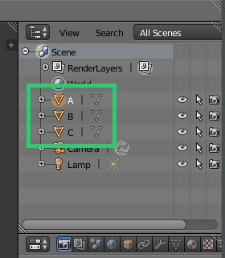

.. _more_features:

More Features
=============

Plotting Categories
-------------------

To plot data that is grouped into categories, you can use the -c flag and specify the name of the column to group the data points by. Each different category will be its own object in the resulting model. This will allow you to easily style the groups with different materials.

::

    blendplot data.csv model.obj height weight cost -c category

